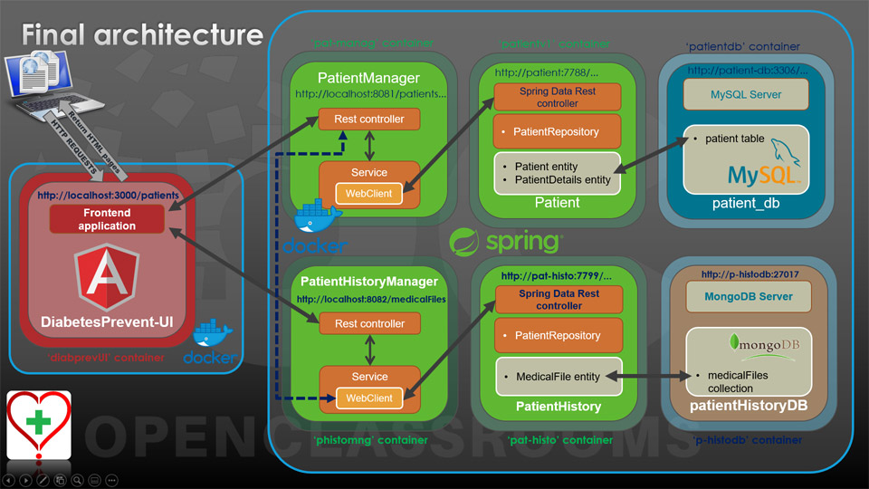

# DiabetesPrevent - v1.0.2 release (2021/01/27)

This application is my Project #9 of OpenClassrooms Java application developer course. 

## Overview:
Diabetes prevent is a Mediscreen application that helps the Practitioner to make Diabetes evaluation reports.
This software is based on a microservices architecture for a Docker containers deployment.

The current 'DiabetesPrevent' GitHub repository contains backend microservices.
An Angular frontend application named 'DiabetesPrevent_UI' is available on the same 'Docky37' directory.

The backend is divided in two parts

- the first part is in charge of the personal information and contains the SpringBoot application 'PatientManager' and 
the Spring Data Rest application 'Patient' connected to a MySQL database.

- the other part manages the medical files of patients and contains the SpringBoot application 'PatientHistoryManager' 
and the Spring Data Rest application 'PatientHistory' connected to a MongoDB database.

**Here, we are in the folder of 'PatientHistoryManager' microservice.**

## Technical

- Application is build with SpringBoot v2.4 and Gradle 6.7
- This application only contains the 'MedicalFile' model entity and the repository interface
- Spring Data Rest is in charge to expose CRUD endpoints that will be requested by 'PatientHistoryManager' WebClient.
- The 'MedicalFile' model entity is mapped (with Hibernate ORM) to the 'medicalFiles' collection of a MongoDB database
named 'patientHistoryDB'.

## Quick way to have a look on the application

- In the 'Quick way to have a look' folder you can fin a docker-compose.yml file that allows you to run the backend of DiabetesPrevent in Docker containers with command line '**docker-compose up -d**'.
- You can also find 2 files that contains patients'data & medical files to test it.

## Import MySQL data

- Copy backup file to running container:   
$ **docker cp [path]/backup.sql docker-compose_patient_db_1:/backup.sql**

- Launch container bash:   $ **winpty docker exec -it docker-compose_patient_db_1 bin/bash**

- Run mySql with root credentials:   root@5b3ec6e48903:/# **mysql -u root -p**

- Select the database:   mysql> **use patient_db**

- Data Import:   mysql> **source backup.sql**

## Import mongoDB data

- Copy backup file to running container :   
$ **docker cp [path]/output.json docker-compose_p-histodb_1:/tmp/output.json**

- Launch container bash:   $ **winpty docker exec -it docker-compose_p-histodb_1 bash**

- Data Import:   root@4555bc18b854:/# **mongoimport -d patientHistoryDB -c medicalFiles tmp/output.json**

## Try it

The application provides Swagger V3 documentation that allows you to test each endpoint of backend with running containers:

- **http://localhost:8081/swagger-ui/index.html#/**  to test Patient's demographics API (Sprint one)
- **http://localhost:8082/swagger-ui/index.html#/**  to test Patient's history & Diabetes evaluation (Sprint 2 & 3)

## Frontend

Another way to enjoy my work, is to run the 'DiabetesPrevent-UI' frontend application (built with Angular).

- Just use  '**docker run -d -p 3000:80 --name diabetesprevent  docky37/diabetes_prevent:diabetes-prevent**'
- Then open your browser and go to '**http://localhost:3000/patients**'
- You probably face a CORS security issue, I have resolved it by running Chrome browser with --user-data-dir="g:/wsp9" parameter.

*Best regards,  Thierry 'Docky' SCHREINER* 

